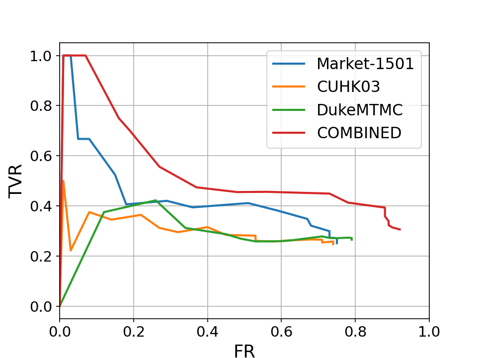

# Benchmarking person re-identification datasets and approaches for practical real-world implementations
Here we are going to publish complete results for our paper.
## Complete results for cross-dataset experiments
This section presents all the results from our cross-dataset Re-ID experiments. Four standard Re-ID approaches are trained on three different standard Re-ID datasets, and evaluated on a different dataset. 
### The complete results from our cross-dataset experiments using only one dataset for train:

| Train       | TEST        | Approach | Rank-1 | Rank-5 | Rank-10 | mAP  | mINP |
|-------------|-------------|----------|--------|--------|---------|------|------|
| CUHK03      | Market-1501 | AGW      | 0.54   | 0.67   | 0.73    | 0.29 | 0.05 |
|             |             | MGN      | 0.66   | 0.81   | 0.86    | 0.39 | 0.08 |
|             |             | SBS      | 0.60   | 0.75   | 0.80    | 0.34 | 0.07 |
|             |             | BoT      | 0.46   | 0.61   | 0.66    | 0.22 | 0.03 |
|             | DukeMTMC    | AGW      | 0.29   | 0.44   | 0.50    | 0.17 | 0.02 |
|             |             | MGN      | 0.50   | 0.65   | 0.70    | 0.31 | 0.04 |
|             |             | SBS      | 0.39   | 0.54   | 0.60    | 0.21 | 0.02 |
|             |             | BoT      | 0.19   | 0.30   | 0.36    | 0.10 | 0.01 |
|             | PRID        | AGW      | 0.07   | 0.14   | 0.18    | 0.11 | 0.11 |
|             |             | MGN      | 0.21   | 0.31   | 0.35    | 0.26 | 0.26 |
|             |             | SBS      | 0.14   | 0.25   | 0.29    | 0.20 | 0.20 |
|             |             | BoT      | 0.06   | 0.10   | 0.13    | 0.09 | 0.09 |
| DukeMTMC    | Market-1501 | AGW      | 0.53   | 0.68   | 0.75    | 0.26 | 0.03 |
|             |             | MGN      | 0.67   | 0.82   | 0.87    | 0.37 | 0.06 |
|             |             | SBS      | 0.61   | 0.77   | 0.82    | 0.31 | 0.03 |
|             |             | BoT      | 0.49   | 0.65   | 0.71    | 0.22 | 0.02 |
|             | CUHK03      | AGW      | 0.06   | 0.13   | 0.18    | 0.06 | 0.03 |
|             |             | MGN      | 0.14   | 0.26   | 0.34    | 0.14 | 0.07 |
|             |             | SBS      | 0.13   | 0.27   | 0.35    | 0.13 | 0.06 |
|             |             | BoT      | 0.05   | 0.10   | 0.15    | 0.05 | 0.03 |
|             | PRID        | AGW      | 0.08   | 0.15   | 0.20    | 0.12 | 0.12 |
|             |             | MGN      | 0.23   | 0.36   | 0.42    | 0.30 | 0.30 |
|             |             | SBS      | 0.12   | 0.22   | 0.26    | 0.17 | 0.17 |
|             |             | BoT      | 0.03   | 0.11   | 0.16    | 0.07 | 0.07 |
| Market-1501 | DukeMTMC    | AGW      | 0.37   | 0.52   | 0.58    | 0.22 | 0.03 |
|             |             | MGN      | 0.58   | 0.73   | 0.77    | 0.39 | 0.06 |
|             |             | SBS      | 0.54   | 0.68   | 0.74    | 0.34 | 0.05 |
|             |             | BoT      | 0.28   | 0.43   | 0.49    | 0.15 | 0.02 |
|             | CUHK03      | AGW      | 0.08   | 0.15   | 0.21    | 0.08 | 0.04 |
|             |             | MGN      | 0.22   | 0.38   | 0.47    | 0.22 | 0.13 |
|             |             | SBS      | 0.19   | 0.31   | 0.40    | 0.18 | 0.11 |
|             |             | BoT      | 0.04   | 0.11   | 0.15    | 0.04 | 0.02 |
|             | PRID        | AGW      | 0.14   | 0.22   | 0.26    | 0.19 | 0.19 |
|             |             | MGN      | 0.22   | 0.35   | 0.40    | 0.28 | 0.28 |
|             |             | SBS      | 0.15   | 0.24   | 0.30    | 0.20 | 0.20 |
|             |             | BoT      | 0.08   | 0.18   | 0.23    | 0.13 | 0.13 |

### The complete results from our cross-dataset experiments using two or more datasets for train:

| Train        | TEST        | Approach | Rank-1 | Rank-5 | Rank-10 | mAP  | mINP |
|--------------|-------------|----------|--------|--------|---------|------|------|
| Market-1501  | CUHK03      | AGW      | 0.13   | 0.25   | 0.32    | 0.14 | 0.08 |
| &            |             | MGN      | 0.28   | 0.45   | 0.55    | 0.27 | 0.17 |
| DukeMTMC     |             | SBS      | 0.26   | 0.42   | 0.52    | 0.24 | 0.14 |
|              |             | BoT      | 0.12   | 0.21   | 0.28    | 0.11 | 0.06 |
|              | PRID        | AGW      | 0.15   | 0.25   | 0.28    | 0.20 | 0.20 |
|              |             | MGN      | 0.27   | 0.37   | 0.42    | 0.32 | 0.32 |
|              |             | SBS      | 0.16   | 0.28   | 0.33    | 0.22 | 0.22 |
|              |             | BoT      | 0.15   | 0.24   | 0.29    | 0.20 | 0.20 |
| CUHK03       | DukeMTMC    | AGW      | 0.44   | 0.59   | 0.65    | 0.29 | 0.05 |
| &            |             | MGN      | 0.63   | 0.77   | 0.81    | 0.44 | 0.08 |
| Market-1501  |             | SBS      | 0.62   | 0.74   | 0.79    | 0.41 | 0.07 |
|              |             | BoT      | 0.35   | 0.48   | 0.55    | 0.21 | 0.03 |
|              | PRID        | AGW      | 0.14   | 0.22   | 0.27    | 0.19 | 0.19 |
|              |             | MGN      | 0.26   | 0.37   | 0.42    | 0.32 | 0.32 |
|              |             | SBS      | 0.20   | 0.29   | 0.34    | 0.24 | 0.24 |
|              |             | BoT      | 0.11   | 0.20   | 0.26    | 0.16 | 0.16 |
| DukeMTMC     | Market-1501 | AGW      | 0.65   | 0.78   | 0.83    | 0.38 | 0.07 |
| &            |             | MGN      | 0.78   | 0.89   | 0.93    | 0.52 | 0.13 |
| CUHK03       |             | SBS      | 0.74   | 0.87   | 0.91    | 0.47 | 0.10 |
|              |             | BoT      | 0.61   | 0.75   | 0.80    | 0.34 | 0.06 |
|              | PRID        | AGW      | 0.09   | 0.19   | 0.24    | 0.14 | 0.14 |
|              |             | MGN      | 0.28   | 0.40   | 0.45    | 0.34 | 0.34 |
|              |             | SBS      | 0.18   | 0.27   | 0.32    | 0.23 | 0.23 |
|              |             | BoT      | 0.06   | 0.13   | 0.16    | 0.09 | 0.09 |
| COMBINED_all | CUHK03      | AGW      | 0.73   | 0.89   | 0.94    | 0.71 | 0.61 |
|              |             | MGN      | 0.83   | 0.93   | 0.96    | 0.82 | 0.74 |
|              |             | SBS      | 0.77   | 0.90   | 0.94    | 0.76 | 0.66 |
|              |             | BoT      | 0.69   | 0.86   | 0.92    | 0.68 | 0.58 |
|              | DukeMTMC    | AGW      | 0.88   | 0.95   | 0.96    | 0.79 | 0.44 |
|              |             | MGN      | 0.91   | 0.96   | 0.97    | 0.82 | 0.49 |
|              |             | SBS      | 0.88   | 0.95   | 0.96    | 0.78 | 0.43 |
|              |             | BoT      | 0.87   | 0.94   | 0.96    | 0.77 | 0.41 |
|              | Market-1501 | AGW      | 0.95   | 0.98   | 0.99    | 0.88 | 0.65 |
|              |             | MGN      | 0.96   | 0.99   | 0.99    | 0.91 | 0.70 |
|              |             | SBS      | 0.95   | 0.98   | 0.99    | 0.88 | 0.64 |
|              |             | BoT      | 0.94   | 0.98   | 0.99    | 0.86 | 0.60 |
|              | PRID        | AGW      | 0.14   | 0.26   | 0.32    | 0.20 | 0.20 |
|              |             | MGN      | 0.29   | 0.42   | 0.45    | 0.35 | 0.35 |
|              |             | SBS      | 0.17   | 0.27   | 0.33    | 0.23 | 0.22 |
|              |             | BoT      | 0.11   | 0.18   | 0.24    | 0.15 | 0.15 |

### The complete results from our scaled cross-dataset experiments using two or more datasets for train:

| Train               | TEST        | Approach | Rank-1 | Rank-5 | Rank-10 | mAP  | mINP |
|---------------------|-------------|----------|--------|--------|---------|------|------|
| Market-1501         | CUHK03      | AGW      | 0.13   | 0.23   | 0.31    | 0.13 | 0.07 |
| &                   |             | MGN      | 0.24   | 0.40   | 0.52    | 0.23 | 0.14 |
| DukeMTMC_SCALED     |             | SBS      | 0.21   | 0.37   | 0.46    | 0.20 | 0.12 |
|                     |             | BoT      | 0.10   | 0.19   | 0.23    | 0.09 | 0.05 |
|                     | PRID        | AGW      | 0.12   | 0.21   | 0.24    | 0.17 | 0.17 |
|                     |             | MGN      | 0.27   | 0.38   | 0.44    | 0.32 | 0.32 |
|                     |             | SBS      | 0.16   | 0.27   | 0.31    | 0.21 | 0.21 |
|                     |             | BoT      | 0.13   | 0.20   | 0.26    | 0.17 | 0.17 |
| CUHK03              | DukeMTMC    | AGW      | 0.41   | 0.56   | 0.62    | 0.26 | 0.04 |
| &                   |             | MGN      | 0.60   | 0.73   | 0.78    | 0.40 | 0.07 |
| Market-1501_SCALED  |             | SBS      | 0.55   | 0.70   | 0.75    | 0.35 | 0.06 |
|                     |             | BoT      | 0.30   | 0.45   | 0.51    | 0.18 | 0.02 |
|                     | PRID        | AGW      | 0.10   | 0.19   | 0.24    | 0.15 | 0.15 |
|                     |             | MGN      | 0.27   | 0.37   | 0.41    | 0.32 | 0.32 |
|                     |             | SBS      | 0.19   | 0.29   | 0.33    | 0.24 | 0.24 |
|                     |             | BoT      | 0.08   | 0.15   | 0.18    | 0.12 | 0.12 |
| DukeMTMC            | Market-1501 | AGW      | 0.65   | 0.78   | 0.83    | 0.38 | 0.08 |
| &                   |             | MGN      | 0.77   | 0.88   | 0.92    | 0.52 | 0.13 |
| CUHK03_SCALED       |             | SBS      | 0.74   | 0.85   | 0.89    | 0.46 | 0.09 |
|                     |             | BoT      | 0.58   | 0.72   | 0.78    | 0.32 | 0.05 |
|                     | PRID        | AGW      | 0.11   | 0.18   | 0.22    | 0.15 | 0.15 |
|                     |             | MGN      | 0.26   | 0.37   | 0.43    | 0.31 | 0.31 |
|                     |             | SBS      | 0.19   | 0.29   | 0.33    | 0.24 | 0.24 |
|                     |             | BoT      | 0.09   | 0.15   | 0.18    | 0.12 | 0.12 |
| COMBINED_SCALED-all | CUHK03      | AGW      | 0.68   | 0.84   | 0.88    | 0.67 | 0.56 |
|                     |             | MGN      | 0.75   | 0.87   | 0.91    | 0.72 | 0.62 |
|                     |             | SBS      | 0.73   | 0.87   | 0.90    | 0.72 | 0.61 |
|                     |             | BoT      | 0.65   | 0.82   | 0.88    | 0.61 | 0.52 |
|                     | DukeMTMC    | AGW      | 0.82   | 0.90   | 0.93    | 0.67 | 0.28 |
|                     |             | MGN      | 0.84   | 0.91   | 0.94    | 0.70 | 0.30 |
|                     |             | SBS      | 0.81   | 0.89   | 0.93    | 0.66 | 0.27 |
|                     |             | BoT      | 0.77   | 0.88   | 0.92    | 0.63 | 0.25 |
|                     | Market-1501 | AGW      | 0.91   | 0.97   | 0.98    | 0.79 | 0.46 |
|                     |             | MGN      | 0.94   | 0.98   | 0.99    | 0.83 | 0.52 |
|                     |             | SBS      | 0.93   | 0.97   | 0.98    | 0.81 | 0.49 |
|                     |             | BoT      | 0.89   | 0.96   | 0.98    | 0.75 | 0.41 |
|                     | PRID        | AGW      | 0.13   | 0.22   | 0.24    | 0.18 | 0.18 |
|                     |             | MGN      | 0.30   | 0.42   | 0.46    | 0.36 | 0.36 |
|                     |             | SBS      | 0.20   | 0.32   | 0.36    | 0.26 | 0.26 |
|                     |             | BoT      | 0.10   | 0.19   | 0.22    | 0.15 | 0.15 |

## Complete results for live Re-ID experiments

This section presents all the results from our live Re-ID experiments. Four standard Re-ID approaches are trained on three different standard Re-ID datasets, and combined with a pedestrian detector for evaluation at the live Re-ID task, using the m-PRID dataset. 

### The complete results from our live Re-ID experiments:

| Training set        | Approach | mAP  | $F_{\text{0.5}}^*$ | $F_{\text{1}}^*$ | $F_{\text{2}}^*$ |
|---------------------|----------|------|--------------------|------------------|------------------|
| CUHK03              | AGW      | 0.23 | 0.33               | 0.39             | 0.54             |
|                     | BoT      | 0.10 | 0.21               | 0.27             | 0.38             |
|                     | SBS      | 0.43 | 0.51               | 0.51             | 0.64             |
|                     | MGN      | 0.60 | 0.69               | 0.66             | 0.73             |
| DukeMTMC            | AGW      | 0.25 | 0.38               | 0.40             | 0.57             |
|                     | BoT      | 0.22 | 0.33               | 0.40             | 0.56             |
|                     | SBS      | 0.54 | 0.59               | 0.58             | 0.70             |
|                     | MGN      | 0.72 | 0.78               | 0.76             | 0.80             |
| Market-1501         | AGW      | 0.33 | 0.43               | 0.46             | 0.57             |
|                     | BoT      | 0.32 | 0.41               | 0.47             | 0.60             |
|                     | SBS      | 0.50 | 0.56               | 0.60             | 0.71             |
|                     | MGN      | 0.63 | 0.69               | 0.69             | 0.75             |
| COMBINED_all        | AGW      | 0.49 | 0.49               | 0.56             | 0.71             |
|                     | BoT      | 0.30 | 0.37               | 0.45             | 0.63             |
|                     | SBS      | 0.71 | 0.71               | 0.71             | 0.79             |
|                     | MGN      | 0.80 | 0.77               | 0.81             | 0.86             |
| COMBINED_SCALED-all | AGW      | 0.39 | 0.45               | 0.49             | 0.63             |
|                     | BoT      | 0.31 | 0.39               | 0.44             | 0.58             |
|                     | SBS      | 0.72 | 0.73               | 0.68             | 0.77             |
|                     | MGN      | 0.75 | 0.80               | 0.77             | 0.84             |

## The TVR vs FR curves for corresponding to these experiments are shown here

### Influence of the standard Re-ID approach. TVR vs FR curves of different standard Re-ID approaches for different training datasets. Evaluation is conducted on the modified PRID-2011 dataset for live Re-ID.

.
.
.
.

### Influence of the training dataset. TVR vs FR curves using different standard Re-ID datasets for training different Re-ID approaches. Evaluation is conducted on the modified PRID-2011 dataset for live Re-ID. 

.
.
.
.
